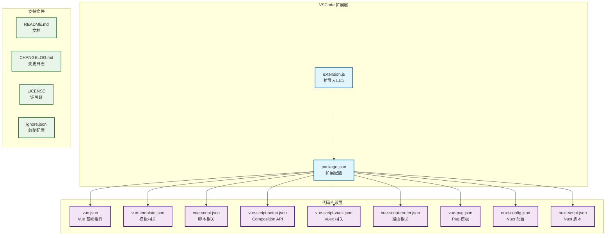

# Vue VSCode 代码片段 - 架构文档

## 项目概述

Vue VSCode Snippets 是一个 Visual Studio Code 扩展，提供了一系列 Vue.js 相关的代码片段，旨在提升开发者的工作效率。

## 架构图



## 详细架构说明

### 1. 扩展核心 (Core Extension)

**文件：** `extension.js`
- **作用：** VSCode 扩展的入口点
- **功能：** 
  - 扩展激活时的初始化
  - 命令注册和处理
  - 扩展生命周期管理

**文件：** `package.json`
- **作用：** 扩展的配置文件
- **关键配置：**
  - `contributes.snippets`: 定义所有代码片段的语言映射
  - `engines`: 支持的 VSCode 版本
  - `categories`: 扩展分类

### 2. 代码片段分类体系

#### 2.1 Vue 基础组件 (`vue.json`)
- **功能：** 提供 Vue 单文件组件的基础模板
- **包含：**
  - 不同样式语言支持 (SCSS, SASS, LESS, PostCSS, Stylus, CSS)
  - TypeScript 支持
  - Composition API 支持
  - Class-based 组件

#### 2.2 模板相关 (`vue-template.json`)
- **功能：** Vue 模板指令和功能
- **包含：**
  - 指令片段 (v-for, v-model, v-on)
  - 样式绑定 (v-style, v-class)
  - 路由链接 (router-link)
  - 事件处理 (emit)

#### 2.3 脚本相关 (`vue-script.json`)
- **功能：** Vue 组件脚本部分
- **包含：**
  - 生命周期方法
  - 数据和方法定义
  - 计算属性和监听器
  - 组件导入和注册

#### 2.4 Composition API (`vue-script-setup.json`)
- **功能：** Vue 3 Composition API
- **包含：**
  - reactive, ref, computed
  - 生命周期钩子 (onMounted, onUnmounted)
  - watch 和 watchEffect
  - setup 语法糖

#### 2.5 状态管理 (`vue-script-vuex.json`)
- **功能：** Vuex 状态管理
- **包含：**
  - store 配置
  - mutations, actions, getters
  - map 辅助函数

#### 2.6 路由相关 (`vue-script-router.json`)
- **功能：** Vue Router
- **包含：**
  - 路由配置
  - 导航守卫
  - 路由组件内守卫

#### 2.7 Nuxt.js 支持
- **`nuxt-config.json`**: Nuxt 配置文件片段
- **`nuxt-script.json`**: Nuxt 页面和组件脚本

#### 2.8 模板引擎 (`vue-pug.json`)
- **功能：** Pug (Jade) 模板支持

### 3. 文件结构关系

```
vue-vscode-snippets/
├── extension.js          # 扩展入口
├── package.json          # 扩展配置
├── snippets/             # 代码片段目录
│   ├── vue.json          # Vue 基础组件
│   ├── vue-template.json # 模板指令
│   ├── vue-script.json   # 脚本功能
│   ├── vue-script-setup.json # Composition API
│   ├── vue-script-vuex.json # Vuex 状态管理
│   ├── vue-script-router.json # 路由相关
│   ├── vue-pug.json      # Pug 模板
│   ├── nuxt-config.json  # Nuxt 配置
│   ├── nuxt-script.json  # Nuxt 脚本
│   └── ignore.json      # 忽略配置
├── README.md            # 英文文档
├── README.ZH.md         # 中文文档
├── CHANGELOG.md         # 英文变更日志
├── CHANGELOG.ZH.md      # 中文变更日志
├── LICENSE             # 许可证
└── images/             # 图片资源
```

### 4. 扩展工作机制

1. **激活阶段**: VSCode 加载扩展，执行 `extension.js` 中的 `activate` 函数
2. **配置读取**: 读取 `package.json` 中的 `contributes.snippets` 配置
3. **片段注册**: 根据配置将对应的 JSON 片段文件注册到相应的语言环境中
4. **用户使用**: 开发者在编辑器中输入前缀，VSCode 自动提示相应的代码片段
5. **片段展开**: 用户选择片段后，VSCode 将片段内容展开到编辑器中

### 5. 技术特点

- **模块化设计**: 每个功能领域有独立的 JSON 文件
- **语言支持**: 支持 Vue、JavaScript、TypeScript、HTML、Pug 等多种语言
- **版本兼容**: 同时支持 Vue 2 和 Vue 3
- **框架扩展**: 支持 Vuex、Vue Router、Nuxt.js 等生态工具
- **样式多样**: 支持多种 CSS 预处理器和模板引擎

## 开发指南

### 添加新片段

1. 在相应的 JSON 文件中添加新的片段定义
2. 更新 `package.json` 中的语言映射（如果需要）
3. 在 README 文档中添加片段说明
4. 更新变更日志

### 片段格式

```json
{
  "片段名称": {
    "prefix": "触发前缀",
    "body": [
      "代码行1",
      "代码行2",
      "${0}光标位置"
    ],
    "description": "片段描述"
  }
}
```

## 性能考虑

- 代码片段以 JSON 格式存储，加载速度快
- 按语言分类，减少不必要的片段加载
- 使用 VSCode 原生的片段系统，性能优化良好

## 扩展性

项目采用模块化设计，易于扩展：
- 添加新的片段文件
- 支持新的 Vue 生态工具
- 支持新的模板语言和样式预处理器